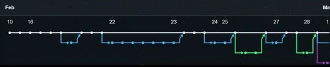

# phishing-training-system

## Created for University of Bath ESP 2022-23 by Group 14

We partnered with a local business in order to create a customised phishing awareness training and information-delivery system. Over the course of 8 months we conducted research, designed, implemented, and delivered this system.

### Please note: 
To comply with the Computer Misuse Act (1990) and GDPR (2016), as well as to protect the security of the organisation we have collaborated with, any information pertaining to this organisation has been removed. Thus this repository is a copy of the final working state of the system and as such, this repository has no history.

## Contibutors (Group 14):
- David B
- Lewis C
- Tom L
- Alba L
- Daniel M
- Vedika P
- Jaymit P
- Alex R

## Available Scripts

In the project directory, you can run:

### `npm start`

Runs the app in the development mode.\
Open [http://localhost:3000](http://localhost:3000) to view it in your browser.

The page will reload when you make changes.\
You may also see any lint errors in the console.

### `npm test`

Launches the test runner in the interactive watch mode.\
See the section about [running tests](https://facebook.github.io/create-react-app/docs/running-tests) for more information.
